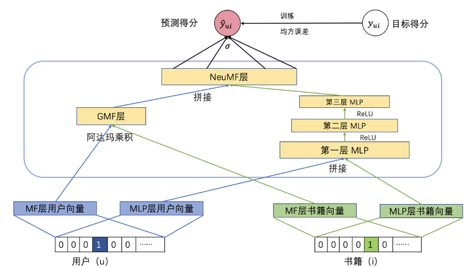
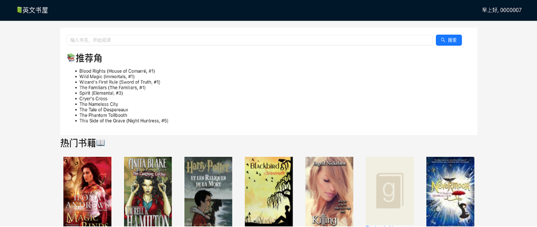

# Recommendation-algorithm-based-on-reviews
# 基于社交评论分析的个性化书籍推荐系统（更新中...)

大多数书籍平台中书籍推荐算法使用的依据是用户的评分，用户收藏以及用户的点赞书本。忽略了用户对书本评论中蕴含的丰富信息，为了探索更多推荐依据以提升推荐精准度，本项目通过对用户的评论文本进行情感分析，对用户进行书本推荐。其中，情感分析使用Google的BERT模型，推荐模型使用NCF模型（类似KNN模型的进阶）。

项目前期需要准备数据集，构建推荐算法模型的所需的Python环境和构建网站所需的环境。
### 由于文件过大，使用百度网盘托管代码
链接: https://pan.baidu.com/s/181Tr943Gty5CSW4GCy-e7Q 提取码: q9xc 
### 数据集
#### 数据集来源
数据集选用来自Goodreads网站的评论数据集，数据集较大，可以根据自己的需求下载并过滤 https://mengtingwan.github.io/data/goodreads#datasets

本次项目需要的数据集有两份，第一份数据集用于预训练基于BERT的情感分析模型，第二份数据用于训练推荐模型。

#### 第一份数据集：用于预训练BERT情感分析模型
预训练BERT模型需要两个元素：评论文本和评分，可以从不同数据集中筛选出来，读者可以按需自设。本次使用的数据集放在data/bookinfo_review.csv数据集的标签包括用户ID，书籍ID，评论ID，评分，评论文本，评论日期，修改日期，阅读日期，开始阅读日期，投票人数，评论数量。通过过滤筛选出需要标签。

部分数据展示
user_id,book_id,review_id,rating,review_text,date_added,date_updated,read_at,started_at	n_votes	n_comments
8842281e1d1347389f2ab93d60773d4d,13239822,a582bfa8efd69d453a5a21a678046b36,3,"This book has a great premise, and is full of some beautifully written prose. ",Mon Jul 02 16:04:16 -0700 2012,Wed Mar 22 11:32:20 -0700 2017,Wed Aug 15 00:00:00 -0700 2012,Sun Aug 12 00:00:00 -0700 2012,7,

#### 第二份数据集：用于训练推荐模型
用于训练推荐模型的数据至少需要三个元素：用户ID，书名（或物品ID）和从用户对物品的评论中分析得出的情感评分（或评分）。其中，使用单个用户与多物品交互的数据集可以提高推荐效率。

部分数据展示
user_id,title_without_series,bert_rating
cfa37f8ff40f4c05fe58462a0344aa27,"Scarlet (The Lunar Chronicles, #2)",5
6a3a8c4abf9dc036d2a652fd364a4556,"New Moon (Twilight, #2)",4
3d7107325f0bd2bd27a34904aededac3,"Winter (The Lunar Chronicles, #4)",3

#### 经过BERT模型分析评论分析后得出的数据集（用于推荐模型）

## 基于评论的个性化书籍推荐算法
要通过用户评论对用户进行的推荐的方法有很多。这次的项目使用的是首先对用户评论文本进行情感分析得出情感得分，随后使用情感得分对用户进行推荐。
### 使用BERT模型对评论文本进行情感分析
使用BERT进行情感分析，可以根据自己的需要在hugging face网站上寻找自己需要的模型。本项目期望的需求是输入短的评论文本，随后得出范围从1-5的情感分析得分。根据这个需求，将https://huggingface.co/nlptown/bert-base-multilingual-uncased-sentiment 模型作为此项目的基础模型，随后使用项目的第一份数据集对此模型进行进一步训练（在BERT模型中这个步骤的概念称为模型微调）。最终模型根据评论文本输出第二份数据集中的bert_rating，其中模型结果如下
| 模型类型       | 准确率   | 差值小于1的准确率     | F1-score     |
| ---------- | ---------- | ------------ | ------------ |
| 预训练模型 | 51.65%      | 88.20%     | 37.86%   |
| 微调后的模型 | 64.02%     | 94.60%     | 50.65%   |


https://www.youtube.com/watch?v=szczpgOEdXs&t=679s 这个视频是使用BERT模型进行情感分析的教程，本项目的情感分析部分参考这个视频完成，有需要的读者可以看看。

### 推荐模型
推荐模型为KNN模型的进阶，成为NCF模型，将KNN模型与MLP模型的输出进行直接拼接，提高推荐模型对复杂数据的学习性能。模型至少需要输入四个数据：用户ID，书本ID，和用户对书本的评分。输入的数据符合第二份数据https://arxiv.org/abs/1708.05031 




至此，模型推荐部分完成
## 个性化书籍推荐网站
网站搭建中，前端使用React+antd搭建。后端使用Node.js连接数据库，使用FastAPI连接推荐模型，数据库使用MySQL。





## 项目结构说明与启动

```
BRsystem
├─ .DS_Store
├─ client
│  ├─ README.md
│  ├─ package-lock.json
│  ├─ package.json
│  ├─ public
│  │  ├─ favicon.ico
│  │  ├─ index.html
│  │  ├─ logo192.png
│  │  ├─ logo512.png
│  │  ├─ manifest.json
│  │  └─ robots.txt
│  └─ src
│     ├─ App.css
│     ├─ App.js
│     ├─ App.test.js
│     ├─ components
│     │  ├─ Login.js
│     │  ├─ Recommendations.js
│     │  ├─ Register.js
│     │  └─ Search.js
│     ├─ contexts
│     │  └─ AuthContext.js
│     ├─ index.css
│     ├─ index.js
│     ├─ logo.svg
│     ├─ reportWebVitals.js
│     └─ setupTests.js
└─ server
   ├─ package-lock.json
   ├─ package.json
   └─ server.js

```


在client新建终端
输入npm start启动react项目

在server输入node server.js启动后端数据库服务

在webapp输入uvicorn fastAPI4R:app --reload启动推荐模型服务